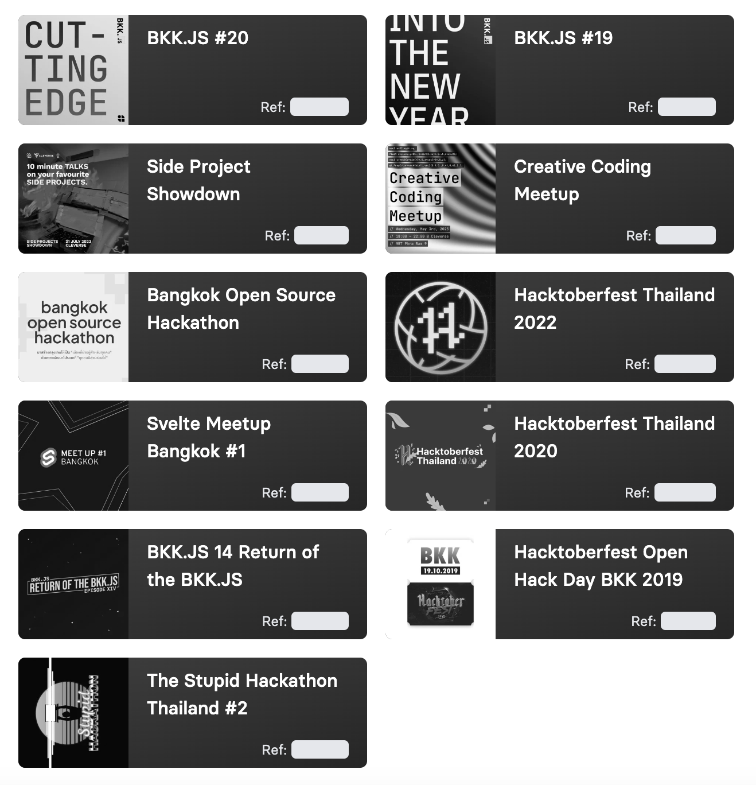

## Juk's Manifesto
> “Perfection is achieved not when there is nothing more to add, but rather when there is nothing more to take away."
> 
> – Jukbot

https://i.redd.it/gc2m1tdq22w81.jpg)
](https://i.redd.it/gc2m1tdq22w81.jpg)

# CHUKKRIT VISITSAKTAVORN

## Contact Information
- **Website:** [juk.life](https://juk.life)
- **Phone:** 086-361-3535
- **Email:** chukkrit.juk@gmail.com
- **LinkedIn:** [jukbot](https://www.linkedin.com/in/jukbot)

## Introduction
Experienced Fullstack Engineer with a strong background in search builder, database hardening, and a keen interest in code quality improvement processes. Proven track record in developing and maintaining robust applications, ensuring high performance and scalability. Adept at working in fast-paced environments and delivering high-quality software solutions. Actively involved in the Thailand developer community, participating in and organizing numerous events such as BKK.JS, Code in the Wind, and various events by Creator Gartens.

## Work Experience

### Contract Fullstack Engineer
**Opsta Co., Ltd.**  
*2024 - Present*
- Developed and maintained full-stack applications, ensuring high performance and scalability.
- Implemented search builder functionalities to enhance data retrieval efficiency.
- Focused on code quality improvement processes, including code reviews and automated testing.

### Fullstack Engineer
**CalCal Co., Ltd.**  
*2020 - Present*
- Designed and developed web applications using modern frameworks and technologies.
- Enhanced database security through hardening techniques and regular audits.
- Collaborated with cross-functional teams to deliver high-quality software solutions.

### Fullstack Engineer
**YelloTalk Co., Ltd. (under Ookbee Co., Ltd.)**  
*2018 - 2020*
- Built and maintained full-stack applications, focusing on user experience and performance.
- Implemented search functionalities to improve data accessibility.
- Conducted code reviews and implemented best practices for code quality.

### Technical Specialist
**IBM Solutions Delivery Co., Ltd.**  
*2017 - 2018*
- Provided technical support and solutions for enterprise applications.
- Worked on database hardening to ensure data security and integrity.
- Participated in code quality improvement initiatives and process optimizations.

## Education
**Bachelor of Science in Computer Science**  
King Mongkut's University of Technology Thonburi, Bangkok, Thailand  
*Class of 2014*

## Domain Skills

### Frontend
- **Technologies:** Polymer, React, VueJS, Svelte

### Backend
- **Technologies:** Django, NodeJS or bun, .NET, Go
- 
### Database
- **Technologies:** Firebase, Redis, SQLite, MySQL (MariaDB), Postgresql family, MongoDB

### Infrastructure
- **Technologies:** Linux, Container, Docker and K8S concepts

## Interests
- Progressive Web Apps
- Cross Platform Application
- Distributed Web using IPFS
- Smart Home Solution using MQTT
- Enterprise Platform Application
- Data Searching
- System Reliability Theory
- Cost optimization

## Projects
- A Distributed Certificate Storage using Inter Planetary File System, SIT KMUTT
- Analytics System for Productivity Improvement in Agriculture (ASPIA), Digital Thailand Big Bang 2017 Exhibition
- Cross platform application using Flutter, Appi Co., Ltd.
  
## Conferences & Workshops
- Global Mobile App Summit and Awards (GMASA) 2016
- UX Talk: EP.3. Empathy, UX Connect, Bangkok University
- Google I/O 2016 Extended, Google Thailand
- Thailand Industry Expo 2016 (OIE Forum), Ministry of Industry
- Firebase Dev Day, Google Developer Expert
- Embedded Linux with Raspberry Pi, Deaware System Co., Ltd.
- Get Started with Web Components, Google Thailand Office
- And much more..

## Community Contribution
- Active participant and organizer in the Thailand developer community.
- Involved in events such as BKK.JS, Code in the Wind, and various events by (Creator Gartens)[https://creatorsgarten.org/events].

## Organized Events and Contributions

---
